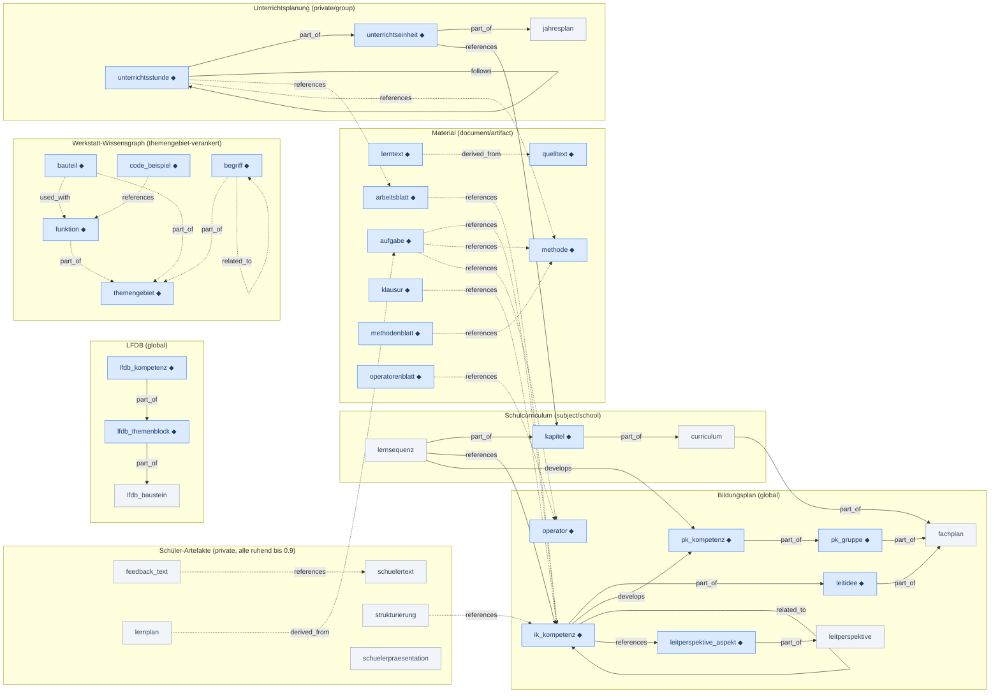

# Einen neuen Knotentyp einführen

Ein `content_type` im Kontextspeicher berührt mehr Stellen, als es zunächst aussieht:
Taxonomie, Embedding, Sichtbarkeit, Lifecycle, Suche, Oberfläche, Werkzeuge, Doku. Diese
Seite ist die Checkliste dafür — damit nichts übersehen wird, und damit die
Entscheidungen begründet sind statt beiläufig getroffen.

Grundlage: `ADR-013` (Kontextspeicher-Graph) und `ADR-017` (Neukonzeption der
Kontextsuche, samt Nachtrag zur Embedding-Frage). Die Suche selbst beschreibt
[kontextsuche.md](kontextsuche.md).

> **Zwei Fallen vorweg**, weil sie beide **stumm** sind — sie führen nicht zu einem
> Fehler, sondern zu falschem Verhalten, das niemandem auffällt:
>
> 1. `VALID_UNTIL_DEFAULTS_DAYS` wird **von Hand** gepflegt. Ein fehlender Eintrag liefert
>    über `.get()` ein `None`, und `None` heißt „läuft nie ab". Ein Typ, der eigentlich
>    verfallen sollte, bliebe für immer stehen. (Ein Test hält die Vollständigkeit fest.)
> 2. Ein Typ mit `embedding: true`, dessen Embedding-Input am Ende **nur aus dem Titel**
>    besteht, ist keine thematische Suche, sondern eine unscharfe Titelsuche im
>    Vektorraum — mit Kosten und ohne Gewinn. Schritt 3 prüft genau das.

## `taxonomy.yaml` ist eine Systemdatei

Sie liegt in `backend/app/context/`, neben ihrem Lader, und **nicht** in `config/`
(ADR-018 samt Nachtrag vom 02.09.2026). Der Ort ist die Aussage: `config/` wird im
Betrieb als ganzes Verzeichnis in den Container gemountet — eine Datei dort ist die
Datei auf dem Host und damit Sache der Schule. Diese ist es nicht; sie steckt im Abbild.
Geändert wird sie hier, im Entwicklungsprozess, und zwar so:

- **YAML-Änderung und Datenmigration gehören in denselben Merge.** Ein Typ, der aus der
  Taxonomie verschwindet, während seine Knoten noch in der Datenbank stehen, ist kein
  Übergangszustand, sondern ein Bestand ohne Zuständigkeit.
- **Jede Typ-Entscheidung bekommt eine Begründung als YAML-Kommentar** — ein Einzeiler
  genügt, aber er muss dastehen. Warum dieser Typ ein Embedding trägt (oder keins),
  warum diese Scopes, warum ruhend.
- **Das Backend prüft beim Start** (`app/context/taxonomy_check.py`) und **startet bei
  einer Abweichung nicht.** Geprüft wird gegen den Datenbestand (kommt jeder vorhandene
  `content_type` in der Taxonomie vor, und in der richtigen Kategorie?) und gegen die
  handgepflegten Tabellen in `app/context/taxonomy.py`. Der datenbankfreie Teil läuft
  zusätzlich in `scripts/check_production.py`; ein Test hält fest, dass das generierte
  `frontend/src/lib/taxonomy.js` zur YAML passt.

Der Abbruch ist Absicht und nicht bequem: Er nimmt die ganze Plattform mit, auch Chat und
Unterrichtsplanung. Die Alternative wäre ein stiller Betrieb mit Knoten, die kein Filter
mehr findet und keine Ansicht mehr einordnet — und das fällt erst Wochen später auf,
wenn niemand mehr weiß, welches Update es war.

---

## Checkliste

### 1. Kategorie wählen

`backend/app/context/taxonomy.yaml`, unterhalb von `categories`. Vier Kategorien, und die
Wahl ist keine Geschmacksfrage — sie bestimmt Farbe, Vorgaben und die Erwartung an den
Inhalt:

| Kategorie | Was hineingehört |
|---|---|
| `document` | Ein Dokument, das jemand bereitstellt (Vorlage, Blatt, Quelltext) |
| `knowledge` | Curricular Gesetztes: Bildungsplan, Curriculum, Methode, Operator |
| `artifact` | Etwas Hergestelltes: Arbeitsblatt, Klausur, Stundenentwurf, Lernplan |
| `concept` | Ein Begriff oder Baustein einer Sache (Funktion, Bauteil, Fachbegriff) |

Die Kategorie ist das **einzige** Feld mit DB-Constraint
(`check_context_nodes_category`). Der `content_type` selbst ist in der Datenbank freier
Text — für ihn allein braucht es **keine Migration**.

### 2. Embedding: ja oder nein?

Das Kriterium aus dem ADR-017-Nachtrag lautet: **Soll dieser Baustein auffindbar sein,
ohne dass man weiß, dass es ihn gibt?** Nur dann `embedding: true`.

Drei Gründe sprechen dagegen:

- **Strukturknoten** — er trägt keinen eigenen Inhalt, sondern hält andere zusammen
  (`fachplan`, `curriculum`, `jahresplan`). Man sucht das Kapitel, nicht den Ordner.
- **Nur über den Namen gesucht** — man kennt ihn und schlägt ihn nach
  (`formatierungsvorlage`, `vokabelliste`). Dafür gibt es die Identifikation.
- **Fremdes Eigentum ohne Suchnutzen** — Schülertexte, Feedback, Lernpläne. Sie gehören
  einer Person, nicht dem Suchraum.

Die Entscheidung kommt als **Einzeiler-Begründung** als Kommentar neben den Eintrag in
`taxonomy.yaml`. Stand 09/2026: 27 von 41 Typen mit Embedding.

### 3. Bei „ja": den Embedding-Input gegenprüfen

⚠️ **Der Schritt, der am ehesten übersprungen wird.** Woraus besteht der Vektor
tatsächlich?

- `embedding_input` in `taxonomy.yaml` — die **einzige** Stelle, an der sich etwas gezielt
  weglassen lässt (Beispiel `unterrichtsstunde`: Titel und Thema, ausdrücklich **ohne**
  Verlaufsplan).
- `embedding_enrichment` — Felder, die zusätzlich hineinwandern.
- sonst der Vorgabeaufbau in `backend/app/context/embedding.py`.

Bleibt am Ende **nur der Titel** übrig, lautet die Entscheidung aus Schritt 2 „nein". Das
ist Identifikationsstoff, keine thematische Auffindbarkeit — `traegt_substanz()` in
`embedding.py` weist solche Knoten ab.

Ein bestehender Typ, dessen `embedding_input` sich ändert, braucht einen **Re-Embed**:
Die alten Vektoren sind dann aus etwas anderem gebildet und nicht mehr vergleichbar.

### 4. Sichtbarkeit: `scope_defaults`

`read_scope`/`write_scope` je Typ in `taxonomy.yaml`. Sie sind **Vorgaben für neue
Knoten**, keine Rechteprüfung — die liegt in `app/context/visibility.py` und gilt
einheitlich für alle Abfragewege.

Faustregel: Bildungsplan `global/global`, Fachschaftsmaterial `school/subject`,
Unterrichtsmaterial `group/private`, Schülerartefakte `private/private`.

### 5. Lifecycle

`VALID_UNTIL_DEFAULTS_DAYS` in `backend/app/context/taxonomy.py` — **auch dann eintragen,
wenn der Wert `None` lautet** (siehe Falle 1 oben). Läuft der Typ zum Schuljahresende ab,
gehört er zusätzlich in `valid_until_default: schuljahresende` in der `taxonomy.yaml`.

**Beides zugleich geht nicht.** Ein Tages-Offset *und* Schuljahresende an demselben Typ
wäre eine Frage der Aufrufreihenfolge, und die steht nirgends geschrieben — die
Startprüfung weist es ab. Stand 09/2026 trägt **kein** Typ einen Tages-Offset; wer den
ersten einführt, begründet ihn (die früheren 42 Tage waren ein verallgemeinertes Beispiel
aus ADR-013 und nie abgestimmt).

### 6. `ui_status`: erscheint der Typ in Auswahlflächen?

`ui_status: aktiv | ruhend` in der `taxonomy.yaml` (fehlt das Feld, gilt `aktiv`).

**`ruhend` heißt: kein Formular, kein Filter, keine Such-Facette, keine Material-Liste.**
Vorhandene Knoten bleiben les-, such- und traversierbar, und die Schnittstelle nimmt sie
weiterhin an — es ist eine Aussage über die Oberfläche, keine Rechteprüfung (die steht in
`visibility.py`).

Die Frage dahinter ist einfach: **Gibt es einen Weg, so einen Knoten anzulegen?** Wenn
nein, gehört der Typ nicht in eine Auswahlliste — dort wäre er ein Versprechen, das die
Anwendung nicht einlöst. Der Wechsel `ruhend → aktiv` gehört in dasselbe Arbeitspaket wie
der Erzeugungsweg und bekommt eine Einzeiler-Begründung in der YAML.

Im Frontend filtern die Helfer in `frontend/src/lib/knotentypen.js` — **nicht**
`RUHENDE_CONTENT_TYPES` direkt verwenden. Sie kennen die Ausnahme, die man sonst
übersieht: Im Editor eines bestehenden Knotens bleibt **sein eigener Typ wählbar**, auch
wenn er ruht. Sonst stünde dort ein leeres Auswahlfeld, und das Speichern schriebe
stillschweigend etwas anderes.

### 7. Rollen-Gewichtung

`_SCHUELER_BONUS` / `_LEHRKRAFT_BONUS` in `backend/app/context/taxonomy.py`. Ein
**Vorzug, kein Filter**, und klein (≤ 0,05). Bildungsplan-Typen bleiben neutral (0), damit
der Prüfsatz auf reinem BP-Bestand vergleichbar bleibt. Kein Eintrag heißt neutral — das
ist ein zulässiges Ergebnis, aber eine bewusste Entscheidung.

### 8. Kanten festlegen

Mit welchen Typen steht der neue in Beziehung, über welche Relation? Der
[Netzwerkgraph](#netzwerkgraph-der-kontexttypen) unten zeigt den Bestand — **er ist
mitzupflegen**, sonst veraltet er mit dem ersten neuen Typ.

Eine **neue Relation** (nicht bloß eine neue Kante zwischen bestehenden Typen) braucht
sehr wohl eine Migration: Sie ist per CHECK gebunden
(`check_context_edges_relation`, `app/db/models.py`).

### 9. Migration — was wirklich nötig ist

| Änderung | Migration? |
|---|---|
| neuer `content_type` | **nein** (freier Text in der DB) |
| `content_type` entfernt oder umbenannt | **ja** — Daten-Update, im selben Merge wie die YAML. Sonst verweigert die Startprüfung den Start (und das zu Recht) |
| neue Relation | **ja** (CHECK-Constraint erweitern) |
| neuer Index | ja, wenn eine Abfrage ihn braucht |
| Backfill der Embeddings | kein Schema, aber ein Lauf (`scripts/`) |

### 10. Oberfläche

- `frontend/src/lib/taxonomy.js` — `CONTENT_TYPE_LABELS` (deutsches Label; der Spiegel
  deckt heute alle 41 Typen ab, das soll so bleiben). Bei importierten
  Bildungsplan-/Curriculum-Typen zusätzlich `BP_CURRICULUM_CONTENT_TYPES`, sonst taucht
  der Typ in der freien `/knowledge`-Liste auf.
- `frontend/src/lib/components/NodeTypeIcon.svelte` — Symbol. Ohne Eintrag erscheint das
  Kategorie-Symbol; das ist zulässig, aber meist nicht gewollt.

### 11. Werkzeuge

Erscheint der Typ in einer Werkzeugbeschreibung des Chats (`backend/app/chat/router.py`,
z. B. die Aufzählung „`leitidee`, `methode`, `themengebiet`")? Werkzeugbeschreibungen
sind Prompt-Text: Was dort nicht steht, wählt das Modell seltener.

### 12. Prüfsatz

Mindestens **ein Fall** in `config/search_eval.yaml`. Ohne ihn ist nicht messbar, ob der
neue Typ die Suche verbessert oder bestehende Treffer verdrängt. Vorgehen:
[kontextsuche.md](kontextsuche.md#ändern-und-messen).

### 13. Dokumentation

Nutzer-Doku (`docs/user/kontext.md`) und, wenn der Typ verwaltet wird, Admin-Doku.
Und diese Seite: Graph ergänzen.

---

## Netzwerkgraph der Kontexttypen

Welcher Typ steht üblicherweise mit welchem in Beziehung. Nützlich für zwei Fragen: Welche
Kanten braucht ein neuer Typ? Und welche Wege nimmt eine Traversierung?

**Lesehilfe**

- Pfeilrichtung wie in ADR-013: A `part_of` B heißt „A ist Teil von B".
- **Durchgezogen** = es gibt einen Erzeuger im Code. **Gestrichelt** = Konvention aus
  ADR-013, für die (noch) kein automatischer Erzeuger existiert; solche Kanten entstehen
  heute nur von Hand über `POST /context/edges`.
- ◆ = `embedding: true` (thematisch auffindbar). Alle übrigen sind über Name, Aufzählung
  und Traversierung erreichbar — nicht über Ähnlichkeit.
- `node_engagement` (Lernstand: Mensch/Gruppe ↔ Wissen) ist **kein** Teil dieses Graphen:
  eigene Tabelle, eigene Semantik.

### Nicht im Graphen

- **Typen ohne typische Kanten** — sie werden angeheftet oder gefunden, aber (noch) nicht
  verknüpft: `formatierungsvorlage`, `vokabelliste`, `praesentation` ◆, `konvention` ◆,
  `sozialform`, `pruefungsanforderung` ◆. Wer einem von ihnen Kanten gibt, trägt ihn in
  den Graphen ein. (Drei davon tragen ein Embedding — auffindbar sind sie also, nur nicht
  verknüpft.)
- **`supersedes`** verbindet Fassungen **desselben** Typs (Bildungsplan-Editionen) und ist
  deshalb keine Typ-zu-Typ-Kante.
- **`requires`** (kuratierte didaktische Voraussetzung, Kompetenz → Kompetenz) hat laut
  ADR-013 bewusst keinen automatischen Erzeuger — aufnehmen, sobald die
  Fachschafts-Kuratierung existiert.
- **`node_engagement`** (`introduced`/`knows`/`mastered`/`struggles_with`) ist die
  Beziehung Mensch/Gruppe ↔ Wissen und lebt außerhalb des Kantenmodells.

### Stand der Prüfung

Gegen den Code geprüft am 01.09.2026 (Vorlage: Entwurf vom 31.08.2026), nachgezogen am
02.09.2026 auf die Bereinigung V1–V5 (41 Typen). Drei Korrekturen gegenüber dem Entwurf,
alle in dieselbe Richtung — im Zweifel war eine Kante als „im Code erzeugt" gezeichnet,
obwohl sie Konvention ist:

- `reflexion --reflects_on--> stunde` war **gestrichelt**: Es gab keinen Erzeuger und
  keine `reflexion`-Knoten — die Nachbereitung liegt als Metadatum an der Stunde
  (`planning/review_service.py`). **Der Typ ist mit AP3 entfallen** (V3), die Kante mit
  ihm; `metadata.reflexion` steht seither im `embedding_input` der Stunde, damit „Was
  habe ich mir zu X notiert?" beantwortbar bleibt.
- `ik --related_to--> ik` ist **durchgezogen**: Der Bildungsplan-Import legt die Kante an
  (`scripts/import_bildungsplan.py`, Vorgabe-Relation für Querverweise).
- Die `part_of`-Kanten des Werkstatt-Teilgraphen sind **gestrichelt**: `themengebiet`
  kommt im Code nur in der Taxonomie, einer Ankertyp-Liste und einem Prompt-Hinweis vor —
  einen Erzeuger für diese Kanten gibt es nicht.
